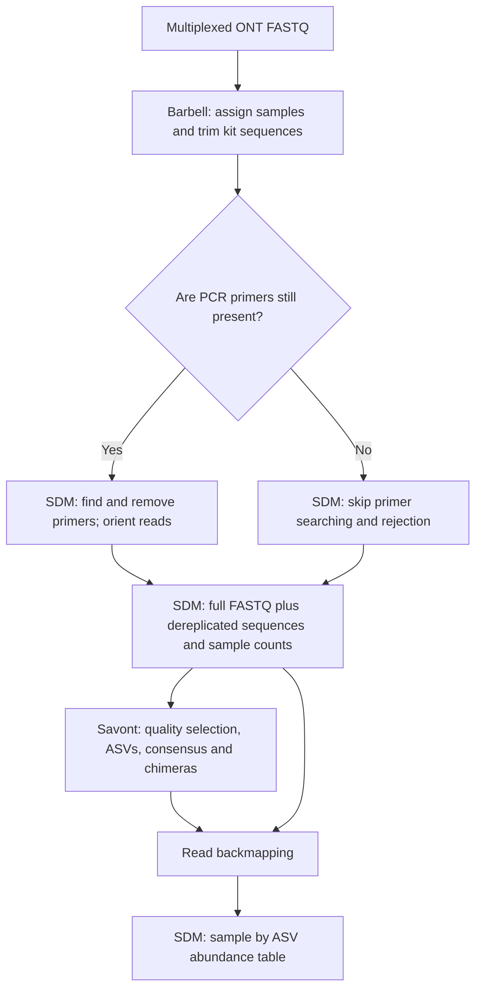

# ONT demultiplexing and SDM audit

Audited 2026-09-12 against the current `dev` checkout, bundled SDM 3.43, and the installer's pinned Barbell 0.3.2 Linux x86-64 executable. The Barbell source archive was verified against the installer's SHA-256 (`2f840c3fe625c62f3d91deadf721da54a8c7b57f8f12a7976cc8cbba273f0daf`). This document records the audit findings at the time of review. The follow-up below distinguishes subsequent fixes from remaining issues.

**SDM 3.51 follow-up (2026-09-12):** LotuS now enables bounded ONT barcode/primer matching in its primary SDM call, exposes the search window and barcode-end requirement, requires a capable SDM executable, and bundles the tested static Linux x86-64 3.51 beta build. Savont input now uses the explicit unlimited `-DemultiBPperSR 0` setting. The earlier 3.43 observations below are historical; see the [ONT guide](ont.md) for current behavior.

## Follow-up implementation

SDM is the primary path. The installer includes Barbell with the ONT tools, using a prebuilt release where available. Accept the all-dependencies choice, select ONT in detailed configuration, or use `--ont-only` to install them; Barbell usage remains optional (`-ontDemux barbell`). LotuS now exposes `-ontPrimerState present|removed`, resolving the primer handoff in finding 1 when the correct state is selected. `-ontBarbellMaximize 0|1` defaults to `0`, resolving the unconditional setting in finding 3. Both tools now have DOI-based citation entries, including Barbell in demultiplex-only runs.

The Barbell 0.3.2 16S filtering problem, kit-specific label validation and assignment-evidence retention remain separate open findings. The [SDM worker brief](sdm_ont_worker_brief.md) defines a small extension to SDM rather than a Barbell-equivalent rewrite. New SDM matching options are not yet implemented or invoked by LotuS.

## Recommendation

Keep Barbell as an optional demultiplexing/trimming stage before SDM. It can replace SDM's barcode assignment for supported ONT library layouts, but it cannot replace the SDM interfaces that LotuS uses for preprocessing, dereplication, sample counts, and abundance-table construction.

The handoff distinguishes **primers still present** from **primers already removed**. Before the follow-up, `-ontDemux barbell` assumed primers remained for every kit, which is incorrect for Barbell's built-in 16S templates.



The branch for already-removed primers is now selected with `-ontPrimerState removed`. The findings below describe the behavior reproduced before that follow-up.

## Functional comparison

| Responsibility in the current ONT path | Barbell 0.3.2 | SDM / LotuS requirement |
| --- | --- | --- |
| ONT barcode assignment | Kit-aware flank/barcode matching and structural-pattern filtering | Barbell can own this step; SDM then assigns samples by file. |
| Adapter/barcode trimming | Yes; trims matched flanks as well as barcodes | Do not attempt barcode demultiplexing again on trimmed files. |
| PCR-primer removal | Yes if primers are part of the matched kit/custom query; not for arbitrary primers absent from those queries | SDM reads sample-specific primers from the LotuS mapping file and applies primer-presence/mismatch rules. |
| Read orientation | Pinned trimming preserves the input sequence orientation | SDM can orient primer-bearing amplicons. Keep Savont's default both-strand processing for reads whose orientation was not established. |
| Length and sequence-quality policy | Structural barcode filtering is not SDM's length, base-quality, ambiguous-base, or homopolymer filtering | The Savont SDM presets relax quality filters but retain length/primer rules; Savont performs its own downstream quality selection. Other ONT clusterers still use SDM's quality-filtering preset. |
| Full, non-dereplicated FASTQ for Savont | Barbell writes per-label FASTQ with qualities | SDM removes any remaining primers and prepares the per-sample `.fq` inputs consumed by LotuS. |
| Dereplication with counts per sample | No LotuS-compatible dereplication/map output | Required by the current Savont backmapping path, including `derep.fas`, `derep.map`, and HQ representative reads. |
| Read-to-ASV counts and final matrix | No equivalent to SDM's mapping/matrix interface | LotuS calls SDM again with `-optimalRead2Cluster`, `-derep_map`, and `-otu_matrix`. |
| Sample mapping, combined samples and sequencing runs | Barcode labels and output groups | LotuS/SDM preserve SampleID, CombineSamples, SequencingRun and downstream metadata. |
| Reports | Annotation, pattern and filtered TSVs | These complement SDM's filtering/dereplication summaries. |

The relevant local flow is `ontBarbellDemux` in [lotus3](../lotus3), then `sdmStep1`, the Savont branch of clustering, backmapping, and SDM's seed/matrix call. Even removing only the first SDM pass would require another producer for its dereplication and count-map outputs. Replacing the later SDM call would also require a new abundance-table implementation. Barbell does not provide those interfaces.

## Findings

### 1. High, fixed by explicit primer state: invalid handoff for some kits

`lotus3` selects `configs/sdm_ONT_primersonly.txt` whenever Barbell and Savont are selected. That preset requires both primers in the main read stream (`RejectSeqWithoutFwdPrim T` and `RejectSeqWithoutRevPrim T`). Its header assumes Barbell leaves primer-bearing reads.

Barbell's `SQK-16S024` and `SQK-16S114-24` presets include the 16S primers in their flanks: `AGAGTTTGATCATGGCTCAG` and `CGGTTACCTTGTTACGACTT`. Trimming cuts at the flank boundaries, so a properly trimmed two-ended read has already lost both primers. This differs from native/rapid barcoding of a separately amplified, primer-bearing product. See the pinned [kit definitions](https://github.com/rickbeeloo/barbell/blob/v0.3.2/src/kits/kits.rs) and [trimming implementation](https://github.com/rickbeeloo/barbell/blob/v0.3.2/src/trim/trim.rs).

After supplying corrected 16S patterns to Barbell separately (see finding 2), its output contained 12 primer-free 1,400 bp reads. Passing these to real SDM with the current preset and primer-bearing map yielded **0 accepted reads**. A temporary SDM map without primer columns and a preset with primer rejection disabled retained **all 12**.

Recommended fix: add an explicit primer-state setting, with verified kit-specific defaults where possible. For primer-bearing reads, retain current primer validation/trimming. For already-trimmed reads, disable both searching and rejection in the working map/preset while retaining the original map for provenance. A custom primer-bearing protocol must remain able to request trimming. Do not disable primer checks globally.

### 2. High: Barbell 0.3.2's built-in 16S filter rejects the expected two-ended pattern

The pinned `KIT_16S` uses `double_label_patterns_*`, which accept patterns formed from `Ftag`/`Fflank`. Its templates annotate the two primer ends as **Ftag and Rtag**. The expected two-ended `Ftag...Rtag` pattern is absent from those filters.

With 12 synthetic 16S reads (two barcodes, both read orientations), the real `kit --maximize` command successfully annotated both tags with zero matching cost but wrote **no demultiplexed FASTQ files**. Its exit code was zero. LotuS subsequently aborts at its existing “no usable per-sample files” check; it cannot recover these reads by changing SDM alone.

Using the same real annotation file with the following custom filters recovered all 12 reads:

```text
Ftag[fw, ?1, @left(0..250), >>]__Rtag[<<, rc, ?1, @right(0..250)]
Rtag[fw, ?1, @left(0..250), >>]__Ftag[<<, rc, ?1, @right(0..250)]
```

Recommended fix: verify an upstream release that corrects this behavior, or implement a tested annotate/filter/trim route with appropriate 16S patterns. Until then, reject or clearly flag the affected built-in kit presets. A version/help probe cannot detect this data-dependent problem. No claim is made here that a newer release fixes it.

### 3. Medium, fixed by opt-in flag: unconditional permissive assignments

Before the follow-up, `ontBarbellDemux` unconditionally included `--maximize`. Barbell's CLI describes this as admitting more risky patterns. Some patterns allow extra or conflicting barcode tags and recover reads by making assumptions about ligation order. SDM validates the amplicon sequence afterward; it cannot establish that a sample assignment was correct. See Barbell's [explanation of maximize mode](https://github.com/rickbeeloo/barbell#the---maximize-flag-explained-in-more-detail-kit-command-only).

For quantitative amplicon analysis, make this an explicit choice and prefer conservative assignment initially. Compare retention and cross-sample leakage using controls before choosing the default. Barbell's “safe” preset still permits some single-ended assignments; applications requiring matching barcodes on both ends need stricter custom patterns.

### 4. Medium: barcode labels need validation against the selected kit

LotuS validates label syntax and uniqueness, then looks for exactly `<label>.trimmed.fastq`. It does not check whether that label belongs to the selected Barbell kit.

In the pinned source, native kits emit `NB01`, `NB02`, etc. Rapid kit 114-96 mostly uses `BC` labels, but positions **26, 39, 40, 48, 54 and 60** use `RBK26`, `RBK39`, etc. The existing BC01/BC02 rapid example is correct. Treating every rapid barcode as `BCxx`, or using `BCxx` for native output, can silently drop those samples while other valid samples allow the run to continue. The dropped-label warning currently groups these together with genuinely absent reads.

Recommended fix: validate/normalize kit-specific labels before processing, and distinguish invalid labels from valid barcodes with no assigned reads. Check actual Barbell labels rather than assuming a universal prefix. See `get_barcodes` in the pinned [kit definitions](https://github.com/rickbeeloo/barbell/blob/v0.3.2/src/kits/kits.rs).

### 5. Medium: useful assignment evidence is removed by normal cleanup

Barbell writes `annotation.tsv`, `pattern_per_read.tsv`, and `filtered.tsv` beneath LotuS's temporary `barbell_raw` directory. Normal end-of-run cleanup removes that directory. The main program log contains command output, but does not preserve the per-read assignment evidence.

Recommended fix: retain assignment/filter summaries under `LotuSLogS`, optionally compressing larger TSVs. Record raw input, assigned, undeclared-label, low-depth, SDM-retained and Savont-used counts separately. This would help diagnose the preceding kit/primer issues and assess assignment policies. `-keepTmpFiles 1` retains the temporary Barbell evidence with the current code.

## Remaining read-retention question

The Savont path passes `-DemultiBPperSR 1e9`, an explicit demultiplex-output quota, even though its comments describe the full read set. SDM's documented unlimited value is `0`. A small direct probe with the bundled 3.43 executable did not enforce a reduced quota in this particular single-end path, so this audit does **not** claim to have reproduced truncation at 1 Gb. The quota should nevertheless be made explicit or disabled, and behavior checked against the SDM version installed by users before promising unlimited Savont input. This is separate from whether Barbell replaces demultiplexing.

## Execution checks

All tests used temporary installations/output directories. The pinned real Barbell binary and bundled real SDM were exercised; neither executable in the checkout was replaced.

| Check | Result |
| --- | --- |
| Rapid kit 114-96, two labels, three forward and three reversed synthetic reads per label | Retained 6 forward-layout reads; reversed layouts were excluded by the pinned kit patterns. The retained reads kept both PCR primers until SDM; SDM retained all 6. This does not establish that reverse-layout reads should be accepted for every rapid library. |
| Native kit 114-96, two labels, both orientations | Barbell retained all 12 with PCR primers present; SDM retained all 12. |
| Built-in 16S kit 114-24, expected two-ended reads | All 12 annotated; 0 demultiplexed by the pinned kit filters. |
| Same 16S annotations with explicit Ftag/Rtag filters | 12 reads trimmed to 1,400 bp with both PCR primers removed. |
| Those primer-free reads through the original primer-bearing SDM preset/map | 0 of 12 accepted. |
| Those primer-free reads through temporary already-trimmed SDM settings | 12 of 12 accepted. |
| LotuS through the abundance-table stage, native kit | Real Barbell -> real SDM -> controlled Savont/mapper -> real SDM: seven full primer-free reads reached Savont, sample counts were 4 and 3, orientation was normalized, and the controlled consensus was preserved. |
| Follow-up LotuS native-kit check, without `--maximize`, both primer states | The real Barbell/SDM path retained all seven reads with counts 4 and 3 in both modes. `present` trimmed/oriented the reads; `removed` preserved primer-free sequence and qualities in both orientations. Both paper citations were present exactly once. |

The integrated check reused the temporary-installation fixture of `tests/ont_integration.py` (now `tests/lib/LotusTest.pm`), substituted the real Barbell executable, and generated native-kit tags around its sample reads. The Savont/mapper portions were controlled to isolate preprocessing and count propagation. These checks establish the described software behavior on Linux x86-64; they do not measure barcode classification accuracy, cross-sample contamination, or ASV accuracy on real experimental data.
